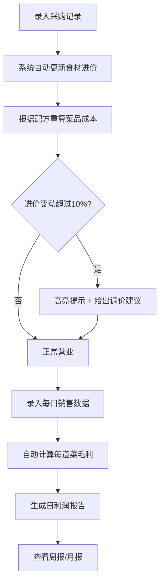
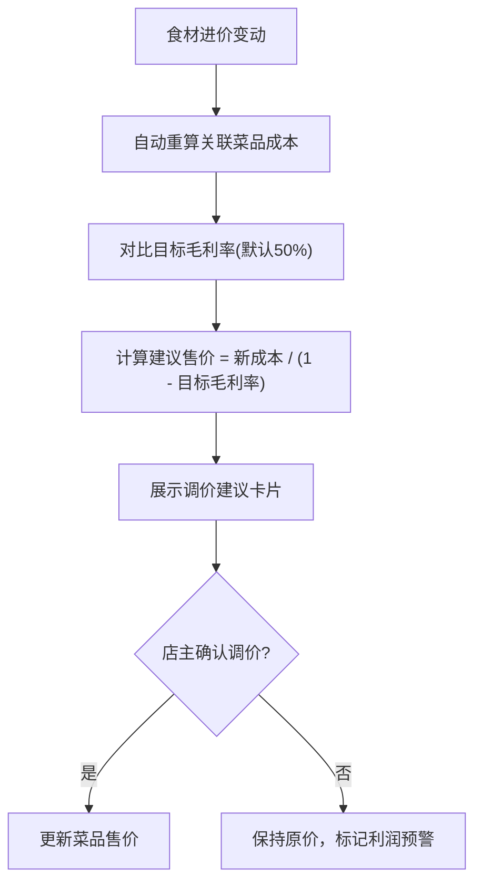

## 1. 产品概述

一款面向小型餐饮店的每日采购与毛利率管理工具。店主每天录入采购食材及花费，系统根据菜品配方自动计算每道菜的成本；日结时汇总销售份数与利润，实时感知菜价波动并给出调价建议；周报/月报自动生成，帮助店主精准掌握经营状况。

- 解决问题：小餐饮店缺乏低成本、易上手的成本核算工具，靠手工记账容易漏算、算错，菜价波动时无法快速决策调价
- 目标用户：小型中餐馆、快餐店、面馆等个体经营者，无需财务知识即可上手

## 2. 核心功能

### 2.2 功能模块

1. **仪表盘**：今日经营概览（采购总支出、营业额、毛利率、最赚菜品）、近7日毛利趋势图、待办提醒
2. **采购管理**：录入每日采购记录（食材名、数量、单价、总价），支持修改历史进价并自动联动重算所有菜品成本
3. **菜品配方**：维护菜品列表及配方（每道菜所需的食材及用量），自动根据最新进价计算菜品成本，展示成本构成饼图
4. **日终结算**：录入每道菜售出份数和售价，自动计算每道菜毛利和毛利率，高亮利润最高/最低菜品，生成日利润报告
5. **统计分析**：周报（最热菜品、最佳营业日、周毛利趋势）、月报（月度总利润、各菜品销量排行、采购支出趋势）、菜价波动追踪与调价建议

### 2.3 页面详情

| 页面名称 | 模块名称 | 功能描述 |
|----------|----------|----------|
| 仪表盘 | 今日概览卡片 | 展示今日采购支出、营业额、综合毛利率、最赚菜品 |
| 仪表盘 | 毛利趋势图 | 近7日毛利走势折线图 |
| 仪表盘 | 快捷入口 | 一键跳转录入采购、录入销售、日终结算 |
| 采购管理 | 采购录入表单 | 选择日期、添加食材项（名称/数量/单位/单价），自动算小计与总计 |
| 采购管理 | 采购历史列表 | 按日期分组展示历史采购记录，支持搜索和筛选 |
| 采购管理 | 进价变动提醒 | 当食材进价较上次变动超过10%时高亮提示 |
| 菜品配方 | 菜品列表 | 卡片式展示所有菜品，显示当前成本和售价 |
| 菜品配方 | 配方编辑 | 为菜品添加/修改食材及用量，实时计算成本 |
| 菜品配方 | 成本构成图 | 饼图展示每道菜的食材成本占比 |
| 菜品配方 | 调价建议 | 当进价变动后，显示"建议售价"以维持目标毛利率 |
| 日终结算 | 销售录入 | 录入每道菜当日售出份数，确认售价 |
| 日终结算 | 日利润报告 | 展示每道菜的销售额、成本、毛利、毛利率，高亮最赚/最亏菜品 |
| 统计分析 | 周报视图 | 本周最热菜品Top5、最佳营业日、周毛利趋势折线图 |
| 统计分析 | 月报视图 | 月度总利润、各菜品销量排行柱状图、采购支出趋势、月度毛利率走势 |
| 统计分析 | 菜价追踪 | 各食材历史进价走势，与调价建议联动 |

## 3. 核心流程

**日常经营流程**：店主每天早上买菜 → 录入采购记录 → 系统自动根据配方更新菜品成本 → 营业中/营业结束录入销售数据 → 日终自动生成利润报告 → 查看周报/月报优化经营决策。

**调价决策流程**：食材涨价 → 系统重算菜品成本 → 对比目标毛利率 → 计算建议售价 → 店主决定是否调价。

## 4. 用户界面设计

### 4.1 设计风格

- 主色调：暖橙色 (#E8652E) — 呼应餐饮行业的烟火气与温暖感
- 辅助色：深炭灰 (#1E1E2E) 背景 + 奶白色 (#FAF8F5) 卡片，营造深夜食堂氛围
- 强调色：翠绿 (#2ECC71) 表示盈利/上涨，红色 (#E74C3C) 表示亏损/预警
- 按钮风格：圆角(8px)、微阴影、hover时轻微上浮
- 字体：标题用 Noto Serif SC (衬线体，有文化感)，正文用 Noto Sans SC (清晰易读)
- 布局风格：左侧固定导航栏 + 右侧内容区，卡片式内容组织
- 图标风格：线性图标，2px描边，橙色主色

### 4.2 页面设计概述

| 页面名称 | 模块名称 | UI元素 |
|----------|----------|--------|
| 仪表盘 | 今日概览卡片 | 4个数据卡片横排，深色卡片配橙色数字，hover轻微放大 |
| 仪表盘 | 毛利趋势图 | 白色卡片内折线图，橙色线条+渐变填充，翠绿/红色标注关键点 |
| 仪表盘 | 快捷入口 | 3个图标按钮横排，圆角矩形，hover橙色边框 |
| 采购管理 | 采购录入表单 | 深色表单区域，橙色提交按钮，食材行可动态增删 |
| 采购管理 | 采购历史列表 | 按日期分组的卡片列表，进价变动项用红色标签标注"涨价"/绿色标注"降价" |
| 菜品配方 | 菜品列表 | 网格卡片布局，每张卡片顶部菜品名+成本+售价，底部迷你饼图 |
| 菜品配方 | 配方编辑 | 侧滑面板，食材列表可增删改，底部实时成本计算 |
| 菜品配方 | 调价建议 | 橙色警示卡片，显示"当前成本→建议售价→需涨价X元" |
| 日终结算 | 销售录入 | 表格形式，每行一道菜，输入份数，右侧自动算毛利 |
| 日终结算 | 日利润报告 | 顶部总利润大数字，下方每道菜利润条形图，最赚绿色高亮、最亏红色高亮 |
| 统计分析 | 周报/月报 | 选项卡切换，图表区(折线图/柱状图) + 排行列表，卡片式布局 |

### 4.3 响应式设计

- 桌面优先设计，利用宽屏展示多列数据卡片和图表
- 平板端：导航栏收起为汉堡菜单，卡片从4列变2列
- 移动端：单列布局，表格改为卡片列表，图表缩放适配

### 4.4 数据持久化

- 所有数据使用 localStorage 持久化存储，无需后端服务器
- 支持导出/导入 JSON 数据备份
