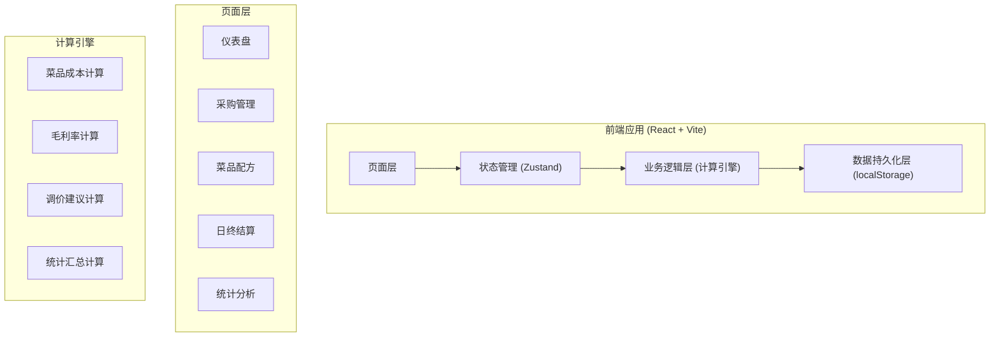
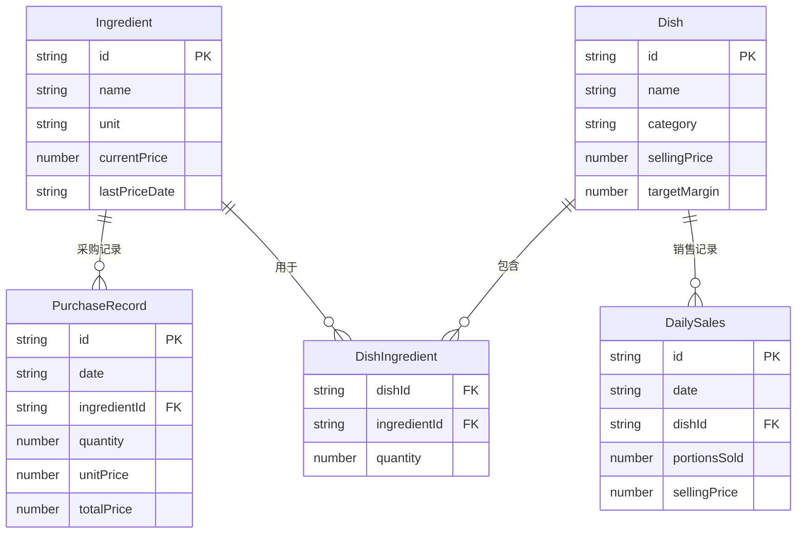

## 1. 架构设计



## 2. 技术说明

- 前端：React@18 + TypeScript + TailwindCSS@3 + Vite
- 初始化工具：Vite (react-ts 模板)
- 状态管理：Zustand (轻量、简洁)
- 图表库：Recharts (React 生态成熟图表库)
- 路由：React Router v6
- 后端：无 (纯前端应用)
- 数据库：localStorage + JSON 序列化，支持导出/导入备份
- 日期处理：date-fns
- 图标：Lucide React
- 动画：framer-motion

## 3. 路由定义

| 路由 | 用途 |
|------|------|
| / | 仪表盘 - 今日经营概览 |
| /purchase | 采购管理 - 录入/查看采购记录 |
| /recipes | 菜品配方 - 管理菜品与配方 |
| /daily | 日终结算 - 录入销售、查看日利润 |
| /stats | 统计分析 - 周报/月报 |

## 4. 数据模型

### 4.1 数据模型定义



### 4.2 数据定义

```typescript
interface Ingredient {
  id: string;
  name: string;
  unit: string;
  currentPrice: number;
  lastPriceDate: string;
}

interface PurchaseRecord {
  id: string;
  date: string;
  ingredientId: string;
  ingredientName: string;
  quantity: number;
  unit: string;
  unitPrice: number;
  totalPrice: number;
}

interface Dish {
  id: string;
  name: string;
  category: "小炒" | "盖饭" | "面条" | "汤";
  sellingPrice: number;
  targetMargin: number;
}

interface DishIngredient {
  dishId: string;
  ingredientId: string;
  ingredientName: string;
  quantity: number;
  unit: string;
}

interface DailySales {
  id: string;
  date: string;
  dishId: string;
  dishName: string;
  portionsSold: number;
  sellingPrice: number;
  costPerPortion: number;
  revenue: number;
  totalCost: number;
  grossProfit: number;
  grossMargin: number;
}

interface StoreState {
  ingredients: Ingredient[];
  purchaseRecords: PurchaseRecord[];
  dishes: Dish[];
  dishIngredients: DishIngredient[];
  dailySales: DailySales[];
}
```

## 5. 核心计算逻辑

### 菜品成本计算
```
菜品成本 = Σ(配方中每种食材用量 × 该食材当前单价)
```

### 毛利率计算
```
毛利率 = (售价 - 成本) / 售价 × 100%
毛利 = 售价 - 成本
```

### 调价建议计算
```
建议售价 = 新成本 / (1 - 目标毛利率)
需涨价金额 = 建议售价 - 当前售价
```

### 日利润汇总
```
日总利润 = Σ(每道菜售出份数 × (售价 - 成本))
日综合毛利率 = 日总利润 / 日总营业额 × 100%
```
